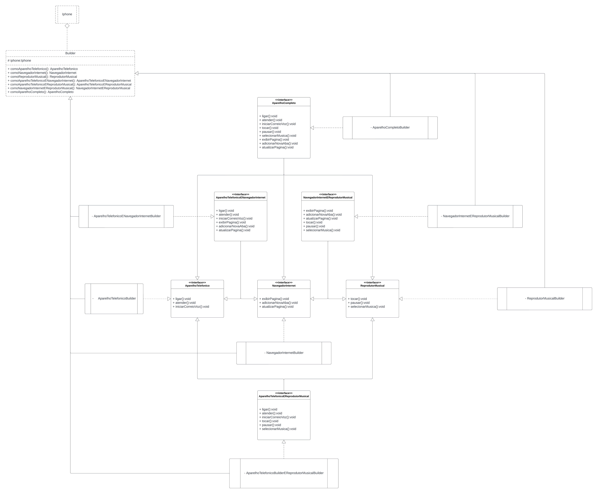

## Resolução Desafio: Orientação a Objetos e UML: Diagramação de Classes do iPhone

### Descrição do Desafio

Chegou a hora de colocarmos em prática toda a concepção de análise de negócios, requisitos, conceitos da programação orientada a objetos e modelagem UML. Com base no vídeo de lançamento do iPhone conforme link abaixo, elabore em uma ferramenta de UML de sua preferência. A diagramação das classes e interfaces com a proposta de representar os papéis do iPhone de: Reprodutor Musical, Aparelho Telefônico e Navegador na Internet. Em seguida crie as classes e interfaces no formato de arquivos .java

### Descrição da Resolução

O código foi construido usando os conceitos dos padrões de projeto Builder e Facade. Como o intuito do desafio era representar os papéis do iPhone, utilizando tais padrões consegui separar as responsabilidades de montar o aparelho aos poucos, dividindo os grupos de funcionalidades específicas (Navegador, Reprodutor e Telefone) e possibilitando todas as combinações de funcionalidades possíveis, resultando em um aparelho altamente customizável.

###  Diagrama de Classes

O arquivo do diagrama está disponível nos formatos PNG e PDF na pasta 'src/assets' do projeto.

